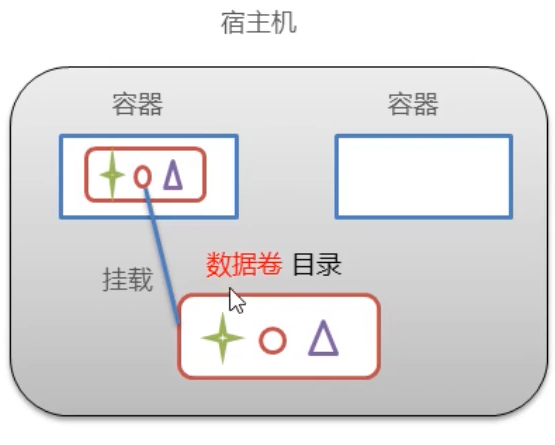
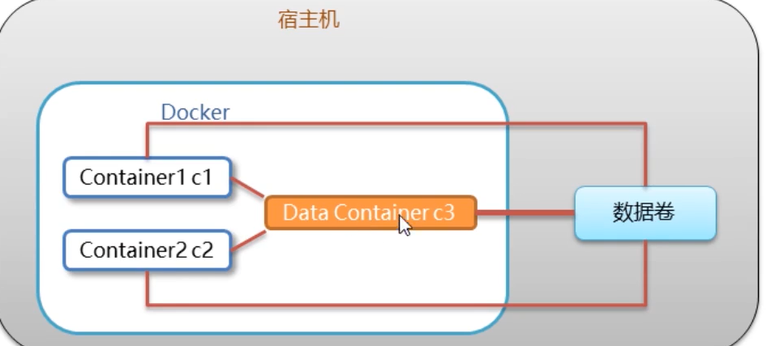

### Docker 学习

#### 1. Docker概念

+ Docker是一个开源应用容器引擎。
+ 完全使用沙箱机制，互相隔离
+ 容器性能极低

```小结：是一种容器技术，解决软件跨环境迁移技术```

#### 2. Docker 命令

##### 2.1 镜像

```shell
# 查看本地镜像
$ docker images

# 搜索网络中的镜像
$ docker search [name] //docker search redis

# 下载镜像 如果不写版本号 默认下载最新 Latest
$ docker pull [name] //  如果有版本号比如 docker pull redis:3.2 

# 删除某个docker 镜像
$ docker rmi [image_ID] 

#或者通过版本号删除 docker rmi [image_name]:[tag]
$ docker rmi redis:5.0

# 查询所有镜像列表的image_id
$ docker images -q

# 如果要删除所有的docker镜像
$ docker rmi `docker images -q`


```

##### 2.2 容器命令

```shell
# 查看容器
$ docker ps # 查看正在运行的容器
$ docker ps -a #查看所有容器

# 创建并且运行容器
$ docker run -it --name=c1 centos:7 /bin/bash 
$ docker run -id --name=c2 centos:7 /bin/bash

# 退出容器
$ exit

# 停止容器
$ docker stop [name/id]

# 启动容器
$ docker start [name/id]

# 进入容器
$ docker exec

# 删除容器
$ docker rm [id/name]

# 查看所有容器的id
$ docker ps -aq

# 删除所有容器
$ docker rm `docker ps -aq`  #不能停止正在运行的容器
$ docker rm c1 c2 c3 c4

# 查看容器信息
$ docker inspect [name/id]


```

> 参数说明：

+ -i 保持容器运行。通常与-t同时使用，加入it这两个参数后，容器创建后 自动进入容器内部，退出容器后，容器也自动关闭
+ -t 为容器重新分配一个伪终端，通常与-i使用
+ -d 以守护模式运行容器，创建一个容器在后台运行，需要使用docker exec进入容器，退出后容器不会关闭。

##### 2.3 容器数据卷

###### 2.3.1 数据卷概念及作用

	> 思考： 1.docker 容器删除后，容器产生的数据还在吗？ **不在了**
	>
	> 2. doker容器和外部机器可以直接交换文件吗 **不可以**
	> 3. 容器之间想要进行数据交互？

  <font color='red'>**数据卷**</font>

+ **数据卷是宿主机中的一个目录或者文件**
+ **当容器目录和数据卷绑定后，对方的修改会立即同步**



**一个容器可以挂载多个数据卷，多个容器也可以挂载一个数据卷**

###### 2.3.2  配置数据卷

+ 创建容器时，使用**-v**参数 设置数据卷 **echo  neirong->文件**

  ```sh
  $ docker run -it --name=C1 -v /root/data:/root/data Centos:7 /bin/bash
  ```

  <font color='red'>**注意：**</font>

  > 1. **`/root/data`** 必须是绝对路径 使用`/` 或者`~/ ` `-v 宿主机目录(文件)：容器内目录(文件)` ,  `~/` 只能在宿主机中使用
  > 2. 可以挂载多个数据卷
  > 3. 如果目录不存在，则自动创建

+ 挂载多个数据卷

  ```shell
  $ docker run -it --name=C2 -v ~/data1:/root/data1 \
  > -v ~/data2:/root/data2 \
  > Centos:7 /bin/bash
  ```

  <font color='red'> **注意：**</font>

  `\` **使用可以换行**

###### 2.3.3 配置数据卷容器

> 问题：多容器进行数据交换  有几种方式
>
> 1. 多个容器挂载同一个数据卷（容器多了的话， 比较麻烦）
> 2. 数据卷容器



+ 创建启动C3数据卷容器，使用-v参数，设置数据卷

  ```SHELL
  $ docker run -it --name=C3 -v /volume centos:7 /bin/bash
  ```

+ 创建c1 c2 容器，使用--volumes-from 参数设置数据卷

       ```SHELL
  $ docker run -it --name=c1 --volumes-from c3 centos:7 /bin/bash
       ```

      ```SHELL
  $ docker run -it --name=c2 --volumes-from c3 centos:7 /bin/bash
      ```

> **小结：**
>
> 1. **数据卷概念**
>    + **宿主机的一个目录或者文件**
> 2. **数据卷的作用**
>    - **容器的数据持久化**
>    - **客户端和容器数据交换**
>    - **容器件数据交换**
> 3. **数据卷容器**
>    + **创建一个容器，挂载一个目录，让其他容器继承该容器（--volumes-from）**
>    + **通过简单方式实现数据卷配置** 	


